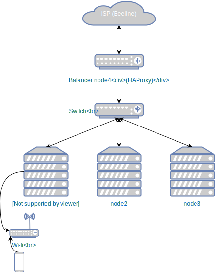

My network
==========

iptables
--------

Opened ports and protocols at balancer:

+---------------------------------------+----------------------------------+
| Port                                  | Comment                          |
+=======================================+==================================+
| 80, 443 (tcp)                         | Default web-server ports         |
+---------------------------------------+----------------------------------+
| 25, 587 (tcp)                         | Mail server ports (SMTP)         |
+---------------------------------------+----------------------------------+
| 993 (tcp)                             | IMAP                             |
+---------------------------------------+----------------------------------+
| 53 (tcp+udp)                          | DNS                              |
+---------------------------------------+----------------------------------+
| 22 (tcp)                              | SSH                              |
+---------------------------------------+----------------------------------+
| ICMP (protocol)                       | Ping                             |
+---------------------------------------+----------------------------------+

Any other input packets are DROPped.

MASQUERADE must be enabled on balancer's ISP interface and node1's
interfaces.

.. code-block:: text

   *nat
   ...
   -A POSTROUTING -o enp3s0 -j MASQUERADE

.. code-block:: bash

   iptables-restore < /etc/iptables.up.rules
   systemctl restart networking.service

# The loopback network interface
auto lo
iface lo inet loopback

# Local network interface
auto enp4s0
#iface enp4s0 inet dhcp
# sudo ip link set eth1 mtu 9000
#allow-hotplug enp4s0
iface enp4s0 inet static
address 10.254.239.4
netmask 255.255.255.0
broadcast 10.254.239.255
# mtu 9000
#gateway 10.254.239.2
dns-nameservers 10.254.239.4

# WAS WORKING
# allow-hotplug enp3s0
# iface enp3s0 inet dhcp
# dns-nameservers 10.254.239.4
# # pre-up ipset restore -file /etc/ipset.rules
# pre-up iptables-restore < /etc/iptables.up.rules
#
# default route was:
# 0.0.0.0         89.179.240.1    0.0.0.0         UG    0      0        0 enp3s0

# STATIC (taken from working ifconfig)
auto enp3s0
iface enp3s0 inet static
address 89.179.240.127
netmask 255.255.248.0
broadcast 89.179.247.255
gateway 89.179.240.1
dns-nameservers 10.254.239.4
# pre-up ipset restore -file /etc/ipset.rules
pre-up iptables-restore < /etc/iptables.up.rules

/etc/resolv.conf overwrite
--------------------------

So that Beeline doesn't overwrite resolv.conf with it's nameservers I
added this to the end of /etc/dhcp/dhclient.conf:

.. code-block:: text

   supersede domain-name-servers 127.0.0.1;

To prepend my DNS to whatever they give I could use:

.. code-block:: text

   prepend domain-name-servers 127.0.0.1;
